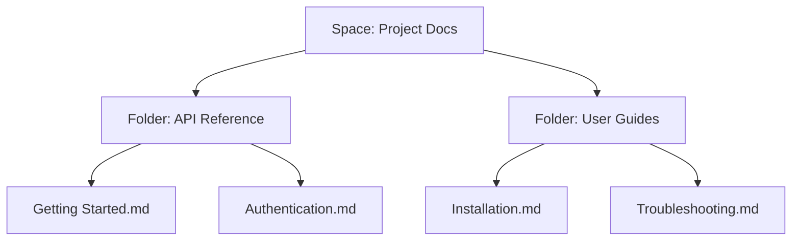

## Overview

Dddd Kkkk provides powerful tools to create, organize, collaborate on, and search your documentation. You streamline your workflow with intuitive document creation, flexible folder structures, real-time collaboration, and advanced search capabilities. These features help teams maintain up-to-date knowledge bases efficiently.

<Columns cols={2}>
  <Card title="Document Creation" icon="edit-3" href="#document-creation">
    Build rich documents with markdown, embeds, and custom components.
  </Card>
  <Card title="Organization" icon="folder" href="#organization">
    Structure your content with nested folders and spaces.
  </Card>
  <Card title="Collaboration" icon="users" href="#collaboration">
    Share and edit documents in real time with your team.
  </Card>
  <Card title="Search" icon="search" href="#search">
    Find content instantly across your entire space.
  </Card>
</Columns>

## Document Creation and Editing

You create new documents directly from the dashboard or within folders. Dddd Kkkk supports markdown editing with live previews, code blocks, and embeds for images or videos.

<Steps>
  <Step title="Create a Document" icon="plus">
    Click the `New Document` button in your space.
    
    Select `Blank Page` or a template like `API Reference`.
  </Step>
  <Step title="Edit Content" icon="edit">
    Use the editor toolbar for headings, lists, and `{code blocks}`.
    
````markdown
# My API Endpoint

## Usage

```javascript
const response = await fetch(`https://api.example.com/v1/docs`, {
  headers: { Authorization: `Bearer ${YOUR_API_KEY}` }
});
```
````
  </Step>
  <Step title="Publish" icon="upload">
    Click `Publish` to make it live. Changes auto-save as drafts.
  </Step>
</Steps>

<Callout kind="tip">
  Enable rich text mode for WYSIWYG editing if you prefer visual tools over markdown.
</Callout>

## Organization and Folder Structures

You organize content into spaces, folders, and subfolders for clear navigation. This hierarchical structure scales for large projects.



Use drag-and-drop to reorder or nest folders. Link pages with `[internal links](/path/to/page)` for better connectivity.

## Collaboration and Sharing Options

Invite team members to collaborate in real time. You control permissions per space or document.

<Tabs>
  <Tab title="Team Invite" icon="users">
    Go to space settings > `Members` > Add email.
    
    Roles: `Editor`, `Viewer`, `Admin`.
  </Tab>
  <Tab title="Public Sharing" icon="share-2">
    Generate shareable links with view-only or edit access.
    
    Embed documents via `<iframe src="https://docs.example.com/embed/doc-id">`.
  </Tab>
  <Tab title="Version History" icon="git-branch">
    View changes, restore versions, or compare edits.
  </Tab>
</Tabs>

## Search Functionality

Search across all documents with full-text indexing. You filter by space, folder, or tags.

| Feature | Description | Example Query |
|---------|-------------|---------------|
| Basic Search | Find keywords | `API authentication` |
| Advanced Filters | By date or author | `from:john since:2024-01-01` |
| Code Search | Locate snippets | `fetch {https://api.example.com}` |

<CodeGroup tabs="JavaScript,cURL">
  ```javascript
  const results = await fetch(`https://api.example.com/v1/search?q=authentication`, {
    headers: { Authorization: `Bearer ${YOUR_API_KEY}` }
  });
  console.log(results.json());
  ```
  ```bash
  curl -H "Authorization: Bearer YOUR_API_KEY" \
       "https://api.example.com/v1/search?q=authentication"
  ```
</CodeGroup>

<Expandable title="Advanced Search Tips" default-open="false">
  Use boolean operators: `auth AND oauth OR jwt`.
  
  Exclude results: `-deprecated`.
</Expandable>

These core features empower you to build a robust documentation system. Explore [quickstart](/quickstart) for hands-on setup.