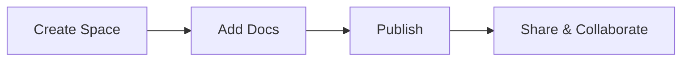

## Overview

Dddd Kkkk provides a centralized space for your project documentation. You create, organize, and publish docs effortlessly, ensuring your team stays aligned. This platform supports Markdown, MDX, and integrates with your workflows for seamless updates.

<Callout kind="info">
Dddd Kkkk handles version control, search, and collaboration out of the box.
</Callout>

## Key Benefits for Project Teams

You gain speed and clarity with Dddd Kkkk. Teams reduce documentation overhead by 50% through intuitive editing and real-time previews.

<Tabs>
  <Tab title="Developers" icon="code">
    Embed live code examples and API references directly in docs.
  </Tab>
  <Tab title="Product Managers" icon="users">
    Centralize roadmaps, changelogs, and user guides for easy access.
  </Tab>
  <Tab title="Support Teams" icon="help-circle">
    Self-serve knowledge base reduces ticket volume by enabling quick searches.
  </Tab>
</Tabs>

## Core Features at a Glance

<Columns cols={3}>
  <Card title="MDX Support" icon="edit-3" href="/docs/mdx-guide">
    Write rich docs with components, diagrams, and interactive elements.
  </Card>
  <Card title="Version History" icon="git-branch" href="/docs/versioning">
    Track changes, revert updates, and maintain changelog automatically.
  </Card>
  <Card title="Search & SEO" icon="search" href="/docs/search">
    Full-text search and optimized rendering for public or private docs.
  </Card>
</Columns>

## Quick Start

Get your first doc live in minutes.

<Steps>
  <Step title="Create Account" icon="user-plus">
    Sign up at `https://dashboard.example.com` with your email.
  </Step>
  <Step title="New Space" icon="plus">
    Click "New Documentation Space" and name it "My Project".
  </Step>
  <Step title="Add First Doc" icon="file-plus">
    Create `introduction.mdx` and paste your content.
  </Step>
  <Step title="Publish" icon="globe">
    Hit publish to generate your live site at `https://docs.example.com/my-project`.
  </Step>
</Steps>

<CodeGroup tabs="JavaScript,Python">
```javascript
// Fetch your docs via API
const response = await fetch('https://api.example.com/v1/docs/my-project', {
  headers: { Authorization: `Bearer ${YOUR_API_KEY}` }
});
const docs = await response.json();
console.log(docs);
```
```python
import requests

response = requests.get(
    'https://api.example.com/v1/docs/my-project',
    headers={'Authorization': f'Bearer {YOUR_API_KEY}'}
)
docs = response.json()
print(docs)
```
</CodeGroup>

## Quick Navigation Guide

<Columns cols={2}>
  <Card title="Quickstart" icon="zap" href="/quickstart">
    Set up your first project in under 5 minutes.
  </Card>
  <Card title="Authentication" icon="shield" href="/authentication">
    Secure your docs with API keys and OAuth.
  </Card>
  <Card title="Guides" icon="book-open" href="/guides">
    In-depth tutorials for advanced usage.
  </Card>
  <Card title="Changelog" icon="git-commit" href="/changelog">
    Stay updated with the latest releases.
  </Card>
</Columns>

<Callout kind="tip">
Explore the <a href="/quickstart">Quickstart guide</a> next to build your first documentation site.
</Callout>

